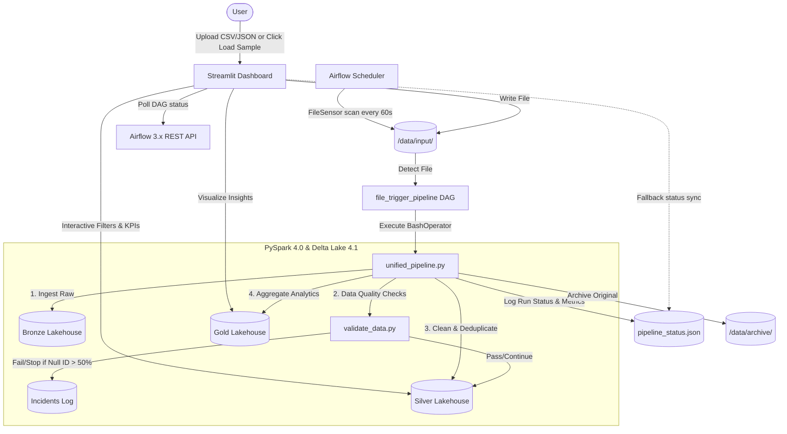

# Medallion Data Engineering Pipeline

An end-to-end, Dockerized Data Engineering pipeline demonstrating a unified Medallion architecture using **Apache Spark 4.0** for data processing, **Apache Airflow 3.x** for scheduling and orchestration, and **Streamlit** for real-time dashboard analytics and ingestion control.

---

## Architecture Diagram



---

## Enhanced Streamlit Dashboard Features

The Streamlit dashboard has been heavily optimized for production UX. It includes:

1. **Auto-Refresh Trigger**: Automatically refreshes the UI every 5 seconds *only* when the pipeline is actively processing to prevent manual page reloads (F5).
2. **Visual Progress Timeline**: Highlights the active execution stage (`Upload → Bronze Ingestion → Silver Transformation → Gold Aggregation`) in real time with dynamic CSS indicators.
3. **Quick Start Sample Loader**: Includes three built-in sample datasets (Small, Medium, and Large) that automatically copy to the input directory and trigger the Airflow DAG via API.
4. **Dataset Information Panel**: Shows the active file name, row counts, size on disk, and directory placement dynamically.
5. **System Health Panel**: Monitors connection states for Airflow (via REST API), Spark (local runtime), and Data Lake availability.
6. **Interactive Visualizations**: Includes interactive age range filters and summary metrics on PySpark-processed Silver and Gold datasets.
7. **Success Notifications**: Alerts users with browser-native notification toasts (`st.toast`) once background pipeline runs successfully complete.

---

## Quick Start & Sample Datasets

The dashboard includes multiple built-in sample datasets stored inside `/data/samples/`. You can trigger them directly from the dashboard:

* **Small Dataset (`small_sample.csv`)**: 100 rows. Fast run time. Contains intentionally dirty data (nulls, duplicates, invalid ages) to demonstrate Data Quality (DQ) validation.
* **Medium Dataset (`medium_sample.csv`)**: 10,000 rows. Ideal for analyzing PySpark execution speeds and transformation rules.
* **Large Dataset (`large_sample.csv`)**: 100,000 rows. Designed to test Spark's partitioning and scalability limits.

---

## Deployment & Setup

### Prerequisites
* Docker and Docker Compose installed.

### Execution
1. Clone the repository and navigate to the project directory:
   ```bash
   cd airflow-spark-medallion-pipeline
   ```
2. Launch the services:
   ```bash
   docker-compose -f docker/docker-compose.yml up --build -d
   ```
3. Access the dashboard:
   * **Streamlit Dashboard**: `http://localhost:8501`
   * **Airflow UI**: `http://localhost:8081` (Default: `admin` / `admin`)
   * **Spark Master UI**: `http://localhost:8080`
